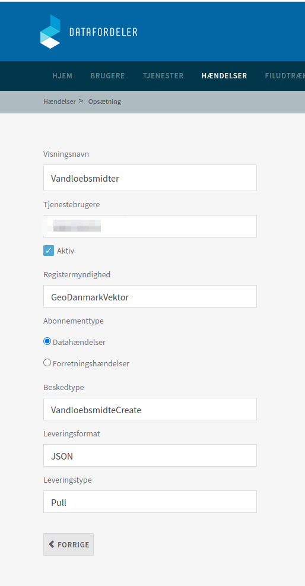

# Eksempel på brug af event med data fra GeoDanamark

## Baggrund
Dette er et eksempel på hvordan man kan bruge events (hændelser) fra Datafordeler til at få en liste af nye Vandløbsmidter. 
Til denne liste af vandløbsmidter kan så få tilføjet tidspunktet for oprettelsen
og navnet på kommunen.

## Forbedrelser
For at kunne gennemføre dette eksempel har man brug for
1. En brugerkonto på Datafordeler (https://selfservice.datafordeler.dk)
1. Et abonnement på GeoDanmarkVektor's vandløbsmidterhænderlser (Create). Oprettelsen af abonnemt kan også ske via (https://selfservice.datafordeler.dk)
1. Viden om brug af Javascript og Node.

## Oprettelse af brugerkonto

Oprettelse af brugerkonto på Datafordeler sker i to trin:
1. Oprettelse af webbruger
1. Oprettelse af tjenestebruger

Webbruger kan oprettes med brugernavn/password.
Tjenestebruger kan også oprettes med brugernavn/password. Det er tjenesterbrugerens brugernavn og password, som bruges til at hente hændelser og informationer fra GeoDanmark

## Oprettelse af hændelsesabonnement


Det er vigtigt, at man opretter et abonnemnt for Registermyndighed GeoDanmarkVektor og Datahændelser

## Software
Installer de to javascript filer:
1. getevents.js - henter events
1. addGeodkinfor.js - henter GeoDK informationer
1. package.json - liste af software pakker

## Installation javascript pakker

```script
npm install
```
## Afvikling
Først hentes events
```
node getevents.js
```
Der dannes en fil event.csv. Denne fil event.csv bruges i addGeodkInfor.js
```
node addGeodkInfor.js
```
Som kan give følgende resultat


| No | Eventid | Eventtype | CreateDate | VirkningsAktør |
| --- | --- | --- | --- | --- |
| 1 | 1210812435 | VandloebsmidteCreate | 2020-06-29T09:39:31.255000+02:00 | Kerteminde kommune |
| 2 | 1210812441 | VandloebsmidteCreate | 2020-06-29T09:39:31.255000+02:00 | Kerteminde kommune |
| 37 | 1210814214 | VandloebsmidteCreate | 2020-06-29T13:09:13.747000+02:00 | SDFE |
| 32 | 1210813510 | VandloebsmidteCreate | 2020-06-29T12:29:39.299000+02:00 | Silkeborg kommune |
| 34 | 1210813512 | VandloebsmidteCreate | 2020-06-29T12:29:39.299000+02:00 | Silkeborg kommune |
| 36 | 1210814205 | VandloebsmidteCreate | 2020-06-29T13:09:13.747000+02:00 | SDFE |
| 0 | 1210812434 | VandloebsmidteCreate | 2020-06-29T09:39:31.255000+02:00 | Kerteminde kommune |
| 33 | 1210813511 | VandloebsmidteCreate | 2020-06-29T12:29:39.299000+02:00 | Silkeborg kommune |
| 31 | 1210813509 | VandloebsmidteCreate | 2020-06-29T12:29:39.299000+02:00 | Silkeborg kommune |

